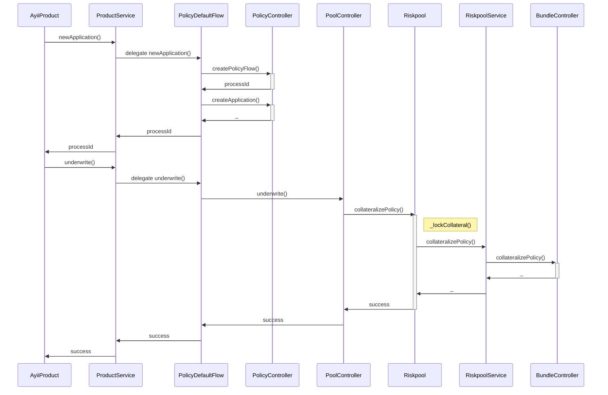

# AYII Product new applicatoon

```mermaid
sequenceDiagram
    participant P as AyiiProduct
    participant PS as ProductService
    participant PDF as PolicyDefaultFlow
    participant PC as PolicyController
    participant POOLC as PoolController
    participant RP as Riskpool
    participant RS as RiskpoolService
    participant BC as BundleController
    P->>PS: newApplication()
    PS->>PDF: delegate newApplication()
    PDF->>+PC: createPolicyFlow()
    PC->>-PDF: processId
    PDF->>+PC: createApplication()
    PC->>-PDF: _
    PDF->>PS: processId
    PS->>P: processId
    P->>PS: underwrite()
    PS->>PDF: delegate underwrite()
    PDF->>POOLC: underwrite()
    POOLC->>RP: collateralizePolicy()
    activate RP
    Note right of RP: _lockCollateral()
    RP->>RS: collateralizePolicy()
    RS->>+BC: collateralizePolicy()
    BC->>-RS: _
    RS->>RP: _
    RP->>POOLC: success
    deactivate RP
    POOLC->>PDF: success
    PDF->>PS: success
    PS->>P: success
```
