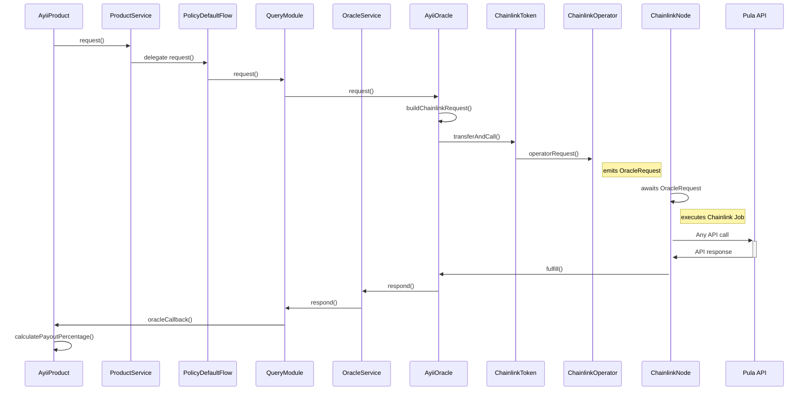

# AYII Product trigger oracle

```mermaid
sequenceDiagram
    participant P as AyiiProduct
    participant PS as ProductService
    participant PDF as PolicyDefaultFlow
    participant QM as QueryModule
    participant OS as OracleService
    participant AO as AyiiOracle
    participant CT as ChainlinkToken
    participant OP as ChainlinkOperator
    participant CN as ChainlinkNode
    participant PA as Pula API
    P->>PS: request()
    PS->>PDF: delegate request()
    PDF->>QM: request()
    QM->>AO: request()
    AO->>AO: buildChainlinkRequest()
    AO->>CT: transferAndCall()
    CT->>OP: operatorRequest()
    Note right of OP: emits OracleRequest
    CN->>+CN: awaits OracleRequest
    Note right of CN: executes Chainlink Job
    CN->>+PA: Any API call
    PA->>-CN: API response
    CN->>AO: fulfill()
    AO->>OS: respond()
    OS->>QM: respond()
    QM->>P: oracleCallback()
    P->>P: calculatePayoutPercentage()
```
