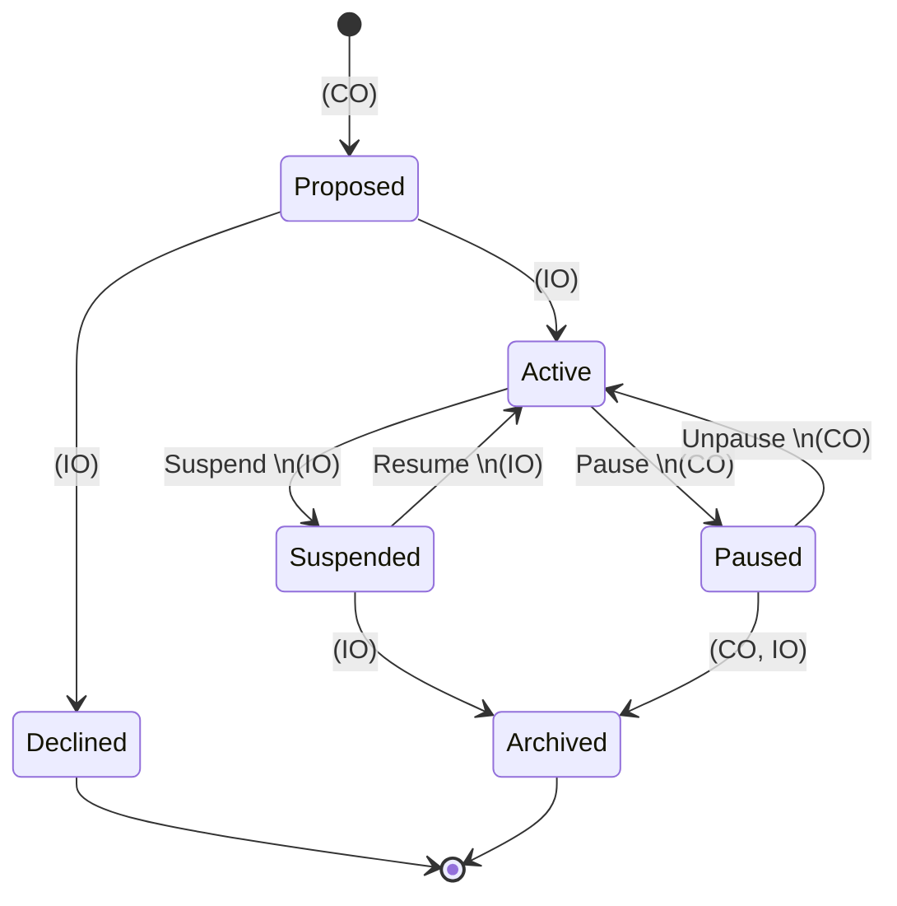

# Component states

## Diagram

```mermaid
stateDiagram-v2
    [*] --> Proposed: (CO)
    Proposed --> Declined: (IO)
    Proposed --> Active: (IO)
    Active --> Paused: Pause \n(CO)
    Paused --> Active: Unpause \n(CO)
    Active --> Suspended: Suspend \n(IO)
    Suspended --> Active: Resume \n(IO)
    Suspended --> Archived: (IO)
    Paused --> Archived: (CO, IO)
    Declined --> [*]
    Archived --> [*]
```
